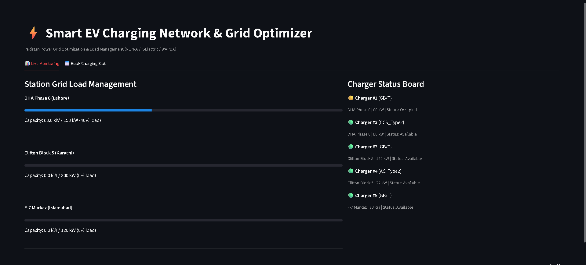
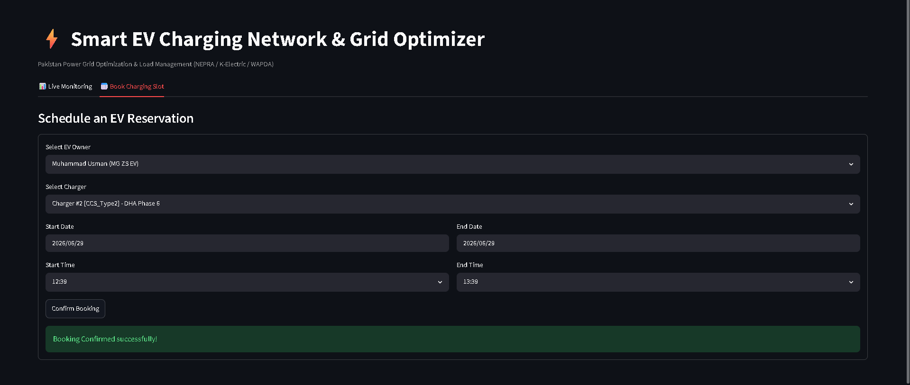

# ⚡ Smart EV Charging Network & Grid Optimizer

> A high-performance, transaction-safe database design and Python integration system localized for the Pakistan Power Grid (NEPRA, K-Electric, WAPDA) to manage dynamic loads, bookings, and dynamic peak/off-peak tariff optimization.

---

## 📸 Screenshots

### Live Monitoring Dashboard


### Booking Scheduling Panel


---


## 🚀 Key Features

* **3NF Database Schema**: Fully normalized database layout to eliminate update anomalies and secure transaction history.
* **ACID Concurrent Booking Engine**: Safe, transaction-safe MySQL Stored Procedure (`BookChargingSlot`) enforcing exclusive resource reservation to prevent double-booking.
* **Automatic Grid Load Mitigation**: Active database trigger (`TrackGridLoadStatus`) that dynamically aggregates real-time charging loads and monitors capacity limits.
* **Pakistan Dynamic Tariff Calculator**: Real-time pricing view (`LiveTariffGrid`) that automatically switches between peak (`PKR 75.00/kWh`) and off-peak (`PKR 50.00/kWh`) rates.
* **Cyberpunk Web Dashboard**: A glassmorphic single-page web dashboard built with Flask, HTML5, CSS Grid, and JavaScript to manage and inspect the network visually.
* **CLI Test Harness**: An alternative lightweight console testing interface.

---

## 🛠️ Tech Stack & Architecture

* **Backend DB**: MySQL (InnoDB)
* **Integration & API Layer**: Python 3.x, Flask, `mysql-connector-python`
* **Frontend**: HTML5, Vanilla CSS3 (Glassmorphic Dark Theme), Vanilla JavaScript
* **Dynamic Tariff Rules**: NEPRA peak-hours scheme (Peak hours: 17:00 to 23:00 local time)

```
ev_grid_optimizer/
│
├── static/
│   ├── app.js             # API polling & interactive reservation logic
│   └── style.css          # Glassmorphic cyberpunk styling
├── templates/
│   └── index.html         # Responsive frontend user interface
├── .gitattributes         # Linguist config to show Python/SQL stats
├── .gitignore             # Environment and cache protection
├── app.py                 # CLI Test Harness
├── db_connection.py       # Safe database driver config loading from .env
├── schema.sql             # Full DDL/DML, Triggers, Views, and Seed Data
└── server.py              # Flask Web Server API backend
```

---

## 📊 Database Design (UNF to 3NF)

To handle dynamic grid loads, user bookings, and changing electricity rates, the database is normalized to **Third Normal Form (3NF)**:

| Table Name | Primary Key | Foreign Key(s) | Normalization Status | Purpose |
| :--- | :--- | :--- | :--- | :--- |
| **`charging_stations`** | `station_id` | *None* | Fully in 3NF | Tracks grid capacity allocated by regional DISCOs |
| **`chargers`** | `charger_id` | `station_id` | Fully in 3NF | Represents physical charging guns (GB/T standard) |
| **`users_and_evs`** | `user_id` | *None* | Fully in 3NF | Registers EV models, battery sizes, and wallet balances |
| **`charging_slots`** | `slot_id` | `charger_id`, `user_id` | Fully in 3NF | Relational transaction table tracking booking slots |
| **`billing_ledger`** | `bill_id` | `slot_id` | Fully in 3NF | Financial invoices computing dynamic Peak/Off-Peak costs |

---

## ⚙️ Setup & Installation

### 1. Initialize the Database
Open **[schema.sql](schema.sql)** inside **MySQL Workbench** or run it directly through the MySQL CLI client:
```sql
SOURCE d:/Downloads/db-lab-project/schema.sql;
```

### 2. Configure Environment Credentials
Create a local `.env` file in the root directory:
```ini
DB_HOST=localhost
DB_NAME=EV_Grid_Optimizer
DB_USER=root
DB_PASS=your_mysql_password_here
DB_PORT=3306
```
*(Note: `.env` is already configured in `.gitignore` to prevent credentials from leaking to GitHub)*

### 3. Install Dependencies
Make sure you have Python 3 installed. Install the required libraries:
```bash
pip install flask mysql-connector-python
```

---

## 🏃 Run the Application

### Option A: Launch the Web Dashboard (Recommended)
Start the Flask web server:
```bash
python server.py
```
Open **`http://127.0.0.1:5000`** in your browser to access the dynamic web interface.

### Option B: Run via Streamlit (Alternative UI)
Install Streamlit and launch:
```bash
pip install streamlit
streamlit run streamlit_app.py
```

### Option C: Run the Command-Line Test Suite
To test transactions and operations directly from the terminal, run:
```bash
python app.py
```

---

## ☁️ Deploying Live on Streamlit Cloud

You can host this dashboard completely live on **Streamlit Community Cloud** using the following steps:

1. **Host MySQL Online**: Set up a free MySQL instance on a cloud provider like **Aiven.io** or **Clever Cloud**.
2. **Import Schema**: Connect your MySQL Workbench to the new online host, and execute **[schema.sql](schema.sql)** to populate the tables and triggers.
3. **Deploy on Streamlit**:
   - Connect your GitHub repository to [Streamlit Community Cloud](https://share.streamlit.io/).
   - Set the main file path to `streamlit_app.py`.
4. **Configure Secrets**: In the Streamlit app settings, open the **Secrets** panel and insert your database credentials:
   ```toml
   DB_HOST = "your-cloud-host.com"
   DB_NAME = "EV_Grid_Optimizer"
   DB_USER = "your-database-user"
   DB_PASS = "your-database-password"
   DB_PORT = "3306"
   ```
5. **Add to Description**: Once deployed, copy your live Streamlit site link and add it to your GitHub repository details!


---

## 🔒 Security Design Notice
Sensitive credentials are never committed directly. A `.env.example` file is included in this repository to show the structure, while local configurations remain safely hidden on your system.
